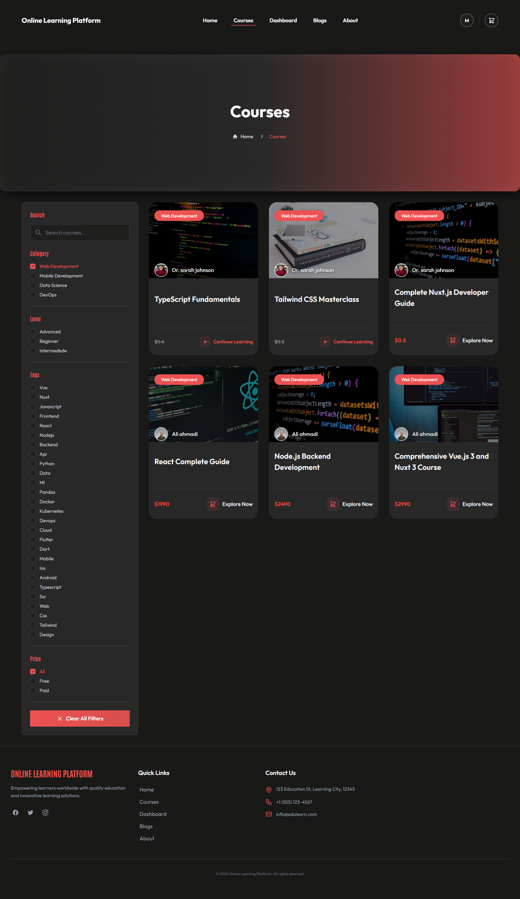
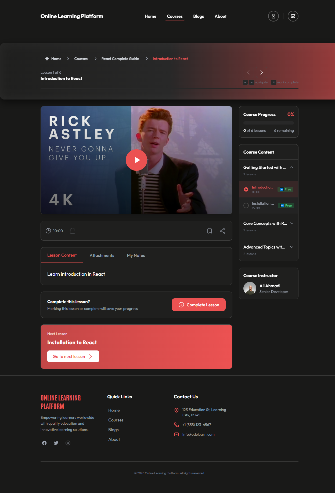

# Online Learning Platform

Frontend-focused **Nuxt 4** learning platform (portfolio): course discovery with shareable filters, accessible lesson player, guest→user cart, student dashboard, blogs, and role-aware admin UI.

**Live demo:** https://online-learning-platform-plum-ten.vercel.app/home  


**Architecture (decisions, FE-first):** [ARCHITECTURE.md](./ARCHITECTURE.md)

### UI screenshots

| Screen | What it shows |
|--------|------------------|
|  | **Course discovery** — URL-driven filters (category/level/tags/price/search) + grid + skeletons. Shown here with the *Web Development* category filter active. |
|  | **Lesson player** — section sidebar + video + prev/next nav + progress. Keyboard shortcuts (`←/→` navigate, `M` mark complete) are hinted below the nav. |

---

## Frontend highlights (what to review)

Built as a **Vue/Nuxt frontend engineer** project that happens to ship its own API — not a backend demo with a thin UI.

| Area | What I implemented |
|------|---------------------|
| **Component architecture** | Domain folders (`courses`, `lesson`, `dashboard`, `home`, `blogs`, `admin`) + reusable `ui/` primitives |
| **Logic extraction** | Pages stay thin; fetch/filter/form/a11y logic lives in **composables** |
| **State discipline** | Pinia = client session only (auth, cart, progress). Lists/details stay in `useFetch` cache — no stale double store |
| **URL as state** | Course filters/search/pagination fully driven by `route.query` (bookmarkable, back/forward-safe) |
| **Nuxt data layer** | `useFetch` with reactive keys, `getCachedData` (SSR payload reuse), `transform`, request dedupe |
| **Forms** | Shared **Zod** schemas + `useZodValidation` (touched, blur/change, debounced field errors, API→field mapping) |
| **Accessibility** | Skip link, focus trap, keyboard roving tabs/menus, ARIA tabs/pagination/search/toasts, lesson shortcuts, live regions |
| **UX states** | Per-domain **skeletons**, `EmptyState` / `ErrorState`, toast stack, `aria-busy` submits |
| **Performance UX** | Below-fold `Lazy*` sections, responsive `NuxtImg` + fallback, debounced search, selective ISR |
| **SEO** | Per-page `useSeoMeta` / `useHead`; private areas kept out of index where appropriate |
| **Safe HTML** | Markdown rendering sanitized via DOMPurify (client + server plugins) |
| **Responsive UI** | Mobile filter drawer, cart drawer, auth/default/minimal layouts |
| **Tested** | ~32 Vitest specs: composables, stores, UI primitives, integration (URL→state→fetch), services vs in-memory DB |

Deep dive with file-level rationale → [ARCHITECTURE.md](./ARCHITECTURE.md)

---

## Product features

- **Auth UI** — sign up / sign in / logout / change password; lazy session hydrate; role-aware nav
- **Course discovery** — filters (category, level, tags, price, search) + pagination in the URL; grid + skeletons
- **Course detail** — curriculum, reviews, related courses (lazy), CTA/cart
- **Lesson player** — section sidebar, content/video, prev/next, complete · bookmark · notes, keyboard shortcuts
- **Lesson progress** — per-lesson complete/bookmark/personal notes, persisted server-side (`/api/progress/*`)
- **Cart & checkout UX** — guest cookie cart, merge on login, drawer, success/fail pages
  - *Checkout is **simulated*** (success/fail toggle), not a real payment gateway — see Scope note below
- **Dashboard** — continue learning, my courses, orders, bookmarks, stats (lazy widgets + skeleton)
- **Blogs** — list/detail, reading time, sanitized markdown; **admins can create/edit/delete posts** via the blog admin flow
- **Instructor role** — instructors get a **"My Courses"** dashboard (`/admin`) to manage their own courses (CRUD); they cannot access the users table
- **Admin UI** — course CRUD forms, blog management, users table (role-gated)
  - **Role model:** `student` / `instructor` / `admin` / `superadmin`. Only a `superadmin` may grant the `admin` role. The `superadmin` role itself is immutable — no user (including another superadmin) can change or delete a superadmin account, and no one can promote anyone *to* superadmin through the UI/API. Administrative accounts (`admin`/`superadmin`) are blocked from purchase actions. Enforced server-side in `server/api/admin/users` and `server/utils/auth-helpers`.

---

## Tech stack

| | |
|--|--|
| **UI framework** | Nuxt 4, Vue 3, TypeScript |
| **Styling** | Tailwind CSS |
| **State** | Pinia + composables |
| **Data fetching** | `useFetch` / `useAsyncData` / `$fetch` |
| **Validation** | Zod (`useZodValidation`) |
| **Images / icons** | `@nuxt/image`, `@nuxt/icon` |
| **A11y helpers** | custom `useFocusTrap`, `useKeyboardFocus` |
| **Utilities** | VueUse (debounce, etc.) |
| **API (same repo)** | Nitro routes, Drizzle + Turso/libSQL, JWT cookies (`jose`), bcrypt |
| **Quality** | ESLint, `nuxi typecheck`, Vitest |

---

## Quick start

```bash
npm install
cp .env.example .env
# JWT_SECRET, TURSO_DATABASE_URL, TURSO_AUTH_TOKEN

npm run dev
# http://localhost:3000 → /home
```

### Environment

```env
JWT_SECRET=your-super-secret-jwt-key-here
TURSO_DATABASE_URL=libsql://...
TURSO_AUTH_TOKEN=...
NODE_ENV=development
PORT=3000
```

### Seed demo accounts

```bash
npm run db:seed
```

| Role | Email | Password | Notes |
|------|-------|----------|-------|
| Superadmin | *(set up manually / first admin)* | — | Immutable role — cannot be changed or deleted via UI |
| Admin | `admin@example.com` | `password123` | Can manage courses/users/blogs; **cannot purchase** |
| Instructor | *(assignable) | — | Gets a "My Courses" dashboard, not the users table |
| Student | `student@example.com` | `password123` | Standard learner account |

> Note: `admin` / `superadmin` accounts are intentionally blocked from checkout (purchase actions are restricted to students/instructors).

### Scripts

| Command | |
|---------|--|
| `npm run dev` | Dev server |
| `npm run build` / `preview` | Production |
| `npm run test` / `test:run` / `test:coverage` | Vitest |
| `npm run typecheck` | Vue/TS |
| `npm run lint` | ESLint |
| `npm run db:seed` | Demo data |

Migrations: `npx drizzle-kit generate`, then `npm run dev` / `build` (app migrate path).

---

## Where to look in the code (FE tour)

```
app/pages/                 # route composition only
app/components/ui/         # accessible primitives (Tabs, Pagination, Search, Toast, …)
app/components/courses/    # discovery + detail UI + skeletons
app/components/lesson/     # player chrome
app/composables/           # controllers (filters, course, lesson, forms, a11y)
app/stores/                # user · cart · lesson-progress · course share-cache
app/schemas/               # Zod shared with API
app/middleware/            # lazy auth hydrate · admin gate
app/layouts/               # skip-link shell · auth · minimal
```

Suggested review path for recruiters:

1. `app/composables/useCourseFilters.ts` + `utils/course-helpers.ts` — URL as state  
2. `app/composables/useCourse.ts` + `stores/courses.ts` — fetch cache vs share-cache exception  
3. `app/composables/useZodValidation.ts` + an auth page — form UX  
4. `app/composables/useFocusTrap.ts` + `components/ui/Tabs.vue` / `Pagination.vue` — a11y  
5. `app/pages/home.vue` + a course/lesson page — lazy sections, SEO, skeletons  

---

## Architecture snapshot

- **Dumb UI, smart composables**
- **Pinia ≠ server cache**
- **Filters live in the URL**
- **SSR/hydration and a11y are product requirements**
- Server enforces authz; UI reflects states cleanly

Full write-up: [ARCHITECTURE.md](./ARCHITECTURE.md)

---

## Scope & intent

This is a **portfolio / learning project**. The goal is to show frontend engineering (Nuxt 4, architecture, a11y, UX states) backed by a real but compact full-stack implementation — not a production LMS.

Deliberately simplified (called out so reviewers don't mistake them for bugs):

- **Checkout is simulated** — a success/fail toggle, not a real payment gateway (Stripe etc.). Orders/enrollments/cart all work end-to-end against the DB; only the "bank" is faked.
- **No real email / password-reset flow** beyond local change-password.
- **Seeded demo data is small** (a handful of courses) — enough to exercise every UI state, not a content library.
- **Admin/superadmin cannot purchase** by design (purchase actions are restricted server-side).

What *is* real and worth reviewing: the Nuxt data layer, URL-driven filtering, a11y primitives, form/validation patterns, and the server-side authorization model (role gating, immutable superadmin).

---

## Deploy

- Live: https://online-learning-platform-plum-ten.vercel.app/home  
- Production needs strong `JWT_SECRET` + Turso credentials  
- Course **detail** ISR-friendly; course **list** must not be cached by path alone (query-driven)  
- Portfolio scope: checkout is app-level flow, not a full payment-provider integration  

## Author

**Mehdi Absalan** — Frontend / Nuxt Developer

- GitHub: [@mehdi-absln](https://github.com/mehdi-absln)
- LinkedIn: [mehdi-absalan](https://www.linkedin.com/in/mehdi-absalan-b46703215/)

If you like the code or want to talk about a role, reach out via the links above.

## License

This repository is public for portfolio review and educational purposes.
The code is not licensed for commercial deployment without explicit permission.
